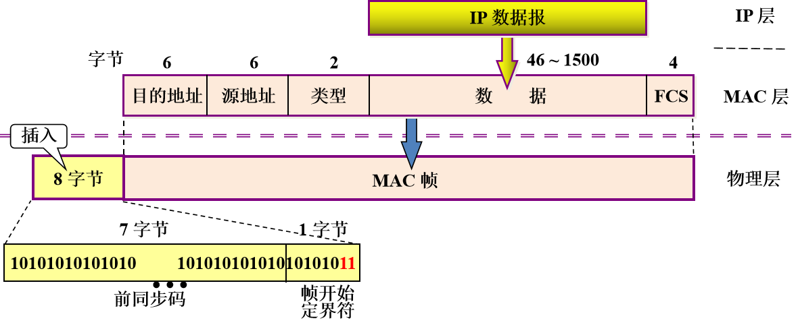

## 数据链路层基本概念

### 链路、数据链路和帧

**链路**：一条点到点物理线路，中间没有任何其他交换节点

**数据链路**：把实现数据传输的协议的硬件和软件加到链路上，就构成了数据链路。

**帧**：对等实体之间水平方向逻辑通信的协议数据单元PDU

### 三个基本问题

1. 封装成帧

在一段数据的前后分别添加首部和尾部，构成一个帧。帧首和帧尾的一个重要作用就是进行帧定界。

组帧方法包括：

组帧方法     | 描述 
-------- | ----- 
字节填充 | 使用特定字符来定界一帧的开始和结束，SOH表示帧开始，EOT表示帧结束
零比特填充 | 数据出现连续的5个1就插入1个0
字符计数法 | 在帧头部使用一个计数字段来标明帧内字符数
违规编码法 | 在物理层进行比特编码时，通常采用违规编码法

2. 透明传输

数据链路层对上层交付的传输数据没有任何限制，就好似数据链路层不存在

3. 差错控制

（1）相关概念

**比特差错**：在传输过程中，1 可能会变成 0 而 0 也可能变成 1。

**误码率(Bit Error Rate，BER)**：在一段时间内，传输错误的比特占所传输比特总数的比率。

为了保证数据传输的可靠性，在计算机网络传输数据时，必须采用各种**差错检测**措施，差错检查分为：

- 检错编码：只检测帧在传输过程中出现了差错，并不能定位错误。
- 纠错编码：可以进行前向纠错，单开销较大，计算机网络中较少使用

（2）检错编码

检错编码     | 描述 
-------- | ----- 
奇偶校验码 | 在待发送的数据后面添加1位奇偶校验码。如果有奇数个位产生误码，则奇偶性发生变化，可以检查出误码；如果是偶数个位产生误码，则奇偶性不发生变化，不能检查出误码
循环冗余校验CRC | ①收发双方约定一个生成多项式； ②发送方基于待发送的数据和生成多项式计算出差错检测码并一起传输； ③接收方通过生成多项式计算机收到的数据是否产生了误码。

:::warning ⚠

CRC差错检测技术只能做到无差错接受。

无差错接受是指凡是接收端数据链路层接受的帧都没有比特差错（有差错的帧就丢弃不接受）。

**无比特差错**并不等于**无传输差错**。

:::

（3）纠错编码

**海明码**实现原理：

①在有效信息位中加入几个校验码组成海明码。

②把海明码的每个二进制位分配到几个奇偶校验组中。

③当某一位出错后，就会引起有关的几个校验位的值发生变化。

### 为网络层提供服务

- 无确认的无连接服务：适用于实时通信或误码率较低的通信信道
- 有确认的无连接服务：适用于误码率较高的通信信道
- 有确认的有连接服务：适用于对可靠性，实时性要求较高的场合

## 可靠传输

### 基本概念

数据链路层向上提供的服务类型：

- 不可靠传输：直接丢弃误码的帧
- 可靠传输：即无传输差错，发送端发送什么，接收端接收什么，必须再加上**确认**和**重传**等机制。  

传输差错包括：帧丢失、帧重复、帧乱序等问题

:::tip 

一般情况，有线链路的误码率比较低，为了减小开销，并不要求数据链路层向上提供可靠传输服务，即出现误码，可靠传输由上层处理。

可靠传输服务不仅出现在数据链路层，上层也会出现相关的可靠传输。

:::

### 三种可靠传输机制

检错编码     | 描述 
-------- | ----- 
停止-等待协议（SW）|
后退N帧协议（GBN）|
选择重传协议（SR）|

## 点对点协议

1. 基本概念

点对点协议（Point-to-Point Protocol，PPP）是用户和ISP通信用的数据链路层协议

2. 组成

- 封装方法：一个将 IP 数据报封装到串行链路的方法
- 链路控制协议（Link Control Protocol，LCP）：建立、配置、测试数据链路，协调两端设备相应选项的值（如：封帧格式，分组大小）,进行链路质量管理。
- 网络控制协议（Network Control Protocol，NCP）：每个协议支持不同的网络层协议

3. 应满足的需求

- 简单——首要要求
- 封装成帧 
- 透明性 
- 差错检测(不需要纠错、流量控制、序号等可靠机制) 
- 多种网络层协议 （ IP、 IPX 和 AppleTalk ）
- 多种类型链路 （串行、并行、同步、异步、低速、高速、电的、光的等）
- 检测连接状态 
- 最大传送单元 
- 网络层地址协商 
- 数据压缩协商 
- 验证协商（PAP、CHAP）
- 全双工 

4. 常用的认证协议

- 口令鉴别协议（Password Authentication  Protocol，PAP）：
- 口令握手鉴别协议（Challenge-Handshake Authentication Protocol，CHAP）：

## 介质访问控制

### 信道复用技术

### 随机访问

## 局域网和广域网

### 局域网体系结构

1. 拓扑结构：星形结构、总线形结构、环形结构、星形和总线形的复合结构
- 以太网：逻辑拓扑是总线形结构；物理拓扑是星形或拓展星形结构。
- 令牌环(EEE802.5)：逻辑拓扑是环形结构；物理拓扑是星形结构。
- FDD1(IEEE802.8)：逻辑拓扑是环形结构；物理拓扑是双环结构。

2. 传输介质：光纤、双绞线（主流）等

3. 介质访问控制方式：CSMA/CD、令牌总线、令牌环等

### 以太网

1. 概念：以太网是遵循802.3标准的局域网

2. 传输介质：

参数 | 10Bases | 10Base2 | 10Base-T | 10Base-FL
:--------: | :-----: | :-----: | :-----: | :-----: 
传输媒体 | 基带同轴电缆（粗） | 基带同轴电缆（细） | 非屏蔽双绞线 | 光纤
编码 | 曼彻斯特编码 | 曼彻斯特编码 | 曼彻斯特编码 | 曼彻斯特编码
拓扑结构 | 总线形 | 总线形 | 星形 | 点对点
最大段长 | 500m | 185m | 100m | 2000m
最大结点数目 | 100 | 30 | 2 | 2

3. 以太网MAC帧

（1）基本概念

在局域网中，硬件地址又称为物理地址，或 MAC 地址,或适配器地址。

（2）MAC帧格式

字段 | 说明 
:--------: | -----
类型 | 标志数据部分使用的是什么协议（0x0800：IP；0x8137：IPX）
数据 | 数据字段 46 ~ 1500 字节
FCS | 校验范围是从目的地址到数据端末尾，采用32位循环冗余码

:::tip 

数据字段最小长度：最小帧 长64 字节 - 首部和尾部的18 字节

当数据字段的长度小于 46 字节时，应在数据字段的后面加入整数字节的填充字段

:::

### 虚拟局域网

虚拟局域网（VLAN）是由一些局域网网段构成的与物理位置无关的逻辑组。

三种划分VLAN的方法：
- 基于端口
- 基于 MAC 地址
- 基于 IP 地址

VLAN的优点：
- 有效共享网络资源
- 简化网络管理
- 提高网络的安全性

:::tip 

虚拟局域网并不是一种新型局域网，只是局域网给用户提供的一种服务。

虚拟局域网 VLAN技术可以分割广播域。

:::

### 对比

比较标准 | 局域网 | 广域网
-------- | ----- | ----- 
覆盖范围 | 较小，通常在一个区域内 | 很广，通常跨区域
连接方式 | 普遍采用多点接入技术 | 节点之间都是点到点连接，但为了提高网络的可靠性，一个结点交换机往往与多个节点交换机相连
OSI层次 | 两层：物理层，数据链路层 | 三层：物理层，数据路层，网络层
着重点 | 强调数据传输 | 强调资源共享，通信子树主要使用分组交换技术

两者相似点：
- 广域网和局域网都是互联网的重要组成财构建，从互联网的角度来看，二者平等
- 连接到一个广城网和一个局域网上的主机在该网内进行通信，只需妻使用其网络的物理地址

## 数据链路层设备

### 网桥

### 交换机

1. 概念：交换机本质是一个多端口的网桥，每个端口都可以连接主机或者集线器，每两个端口都是一个冲突域，一般都工作在全双工方式。

2. 特点
- 工作在全双工方式
- 能同时连通许多对接口，使每一对相互通信的主机都能无碰撞地传输数据。 

3. 自学习算法

交换机收到一帧后先进行自学习。查找转发表中与收到帧的源地址有无相匹配的项目。
- 如没有，就在转发表中增加一个项目（源地址、进入接口和时间）。
- 如有，则把原有的项目进行更新。

转发帧。查找转发表中与收到帧的目的地址有无相匹配的项目。
- 如没有，则通过所有其他接口（但进入交换机的接口除外）进行转发。
- 如有，则按转发表中给出的接口进行处理。若转发表中给出的接口就是该帧进入交换机的接口，则应丢弃这个帧（因为这时不需要经过交换机进行转发）。

4. 两种交换模式

- 直通式交换机：检查帧的目的地址后立即发送出去
- 存储转发式交换机：先缓存，检查数据正确后再发送出去

