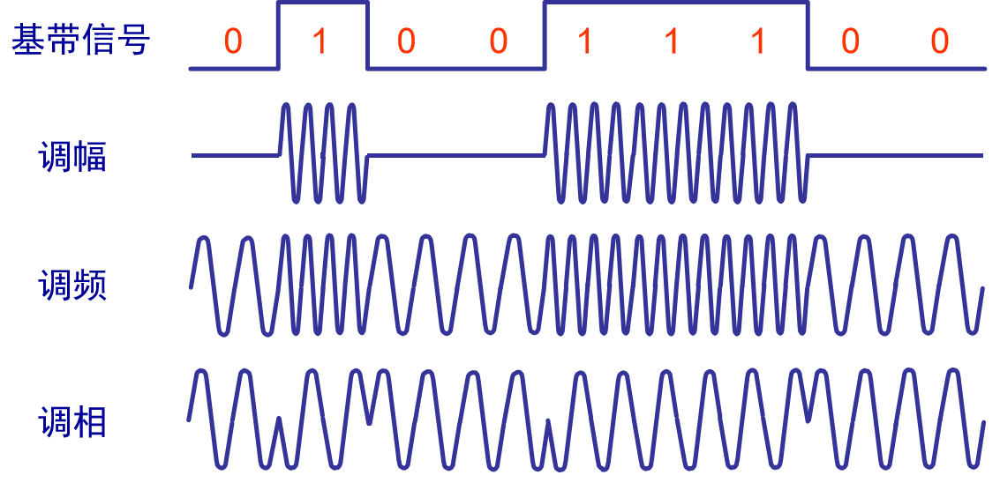

## 物理层基本概念

物理层主要任务：确定与传输媒体的接口的一些特性。

- 机械特性：指明接口所用接线器的形状和尺寸、引线数目和排列等等。
- 电气特性：指明在接口电缆的各条线上出现的电压的范围。
- 功能特性：指明某条线上出现的某一电平的电压表示何种意义。
- 规程特性：指明对于不同功能的各种可能事件的出现顺序。

## 通信基础

### 数据通信术语

通信的目的是交换信息， 信息的载体可以是数字、文字、语音、图像等。

**数据**：运送数据的实体。

**信号**：数据的电气的或电磁的表现。信号分为*模拟信号*和*数字信号*。

- 模拟信号：代表消息的参数取值是连续的，模拟信号的信号电平是连续变化的；
- 数字信号：代表消息的参数的取值是离散的，数字信号是用两种不同的电平表示0、1比特序列。

**信源**：产生或发送数据的源头。

**信宿**：接收数据的终点。

**信道**：用来表示向某一个方向传送信息的媒体。

**三种通信方式**：

- 单工通信：只能有一个方向的通信而没有反方向的交互。
- 半双工通信：通信的双方都可以发送信息，但不能双方同时发送（当然也就不能同时接收）。
- 全双工通信：通信的双方可以同时发送和接收信息。

**两种数据传输方式**：

- 串行传输：速度慢，费用低，适合远距离
- 并行传输：速度快，费用高，适合近距离

### 奈氏准则和香农定理

**信号传输过程中出现差错的原因**

1. 码间串扰

接收端收到的信号波形失去了码元之间清晰界限的现象

2. 失真

信号在传输过程中，由于实际信道有噪声、干扰、带宽的限制，导致接收端接收的信号和发送端发送的信号不一致。

失真的影响因素：码元传输速率、信号的传输距离、噪声干扰、传输媒体的质量。

**奈氏准则**

准则：是在理想低通（没有噪声、带宽有限）的信道中，极限码元传输率为2w波特

理想低通信道下极限数据传输速率 = 2W * log2V

- W是信道带宽，单位:HZ
- V是码元的离散电平数目，即共有几种码元

奈氏准则，可以得出以下结论:

- 在任何信道中，码元传输的速率(采样频率)是有上限的。其实数据传输率理论上来说是没有上限的，因为一个码元能携带二进制数越多，数据传输率越高。
- 信道的频带越宽，就可用更高的速率进行码元的有效传输。

**香农定理**

定理：带宽受限且有噪声的信道中，为了不产生误差，信息的数据传输率有上限值

信噪比：信号的平均功率和噪声的平均功率之比，常记于S/N，并用分贝(dB)作为度量单位。信噪比(dB)=10 lg(S/N)(dB)

信道的极限数据传输速率 = W log2(1+S/N) (b/s)

- W是带宽，单位:HZ
- S/N是信噪比

香农定理可以得出以下结论:

- 要使信道上信息的极限传输速率提高，就要提高信比。信道上的信比固定，传输速率就固定,
- 只要信息的传输速率低于信道极限传输速率，就一定能找到某种方法来实现无差别的传输。
- 实际信道得传输速率要比极限速率低不少。

### 编码和调制

编码：数据 ---> 数字信号

调制：数据 ---> 模拟信号

常用编码：

1. 数字数据*编码*为数字信号

编码方式     | 描述 | 特点
-------- | ----- | -----
归零编码  | 信号电平在一个码元之内都要恢复到零。| 编码在传输过程中处于低电平的情况多，信道利用率低。
非归零编码  | 正电平表示1，负电平表示0。 | 为了保证收发双方的同步，需要额外的一根传输线传输同步信号。即存在同步问题。
反向不归零编码  | 信号电平翻转表示0，信号电平不变表示1。 | 对于全部是1的信号同样难以确认一共发送了多少个信号。
曼彻斯特编码  | 由高到低为“0”，由低到高为“1”。 | 每个比特的中间有一次电平跳变，两次电平跳变的时间间隔可以是T/2或T。利用电平跳变可以产生收发双方的同步信号。
差分曼彻斯特编码  | 若码元为1，则前半个码元的电平与上一个码元的电平相同，若为0，则相反。| 在每个码元中间都有一次电平的跳转。
4B/5B编码  | 比特流中插入额外的比特以打破一连串的0或1，就是用5个比特来编码4个比特的数据，之后再传给接收方。| 编码效率为80%

2. 数字数据*调制*为模拟信号

调制方式     | 描述 
-------- | ----- 
调幅（ASK） | 用载波的两个不同的振幅来表示两个二进制值。无信号表示0，有信号表示1。
调频（FSK） | 用载波的两个不同的频率来表示两个二进制值。信号频率为f表示0，信号频率为2f表示1。
调相（PSK） | 用载波的两个不同的初始相位来表示两个二进制值。信号相位角为0表示0，信号相位角为π表示1。

3. 模拟数据*编码*为数字信号

现在的数字传输系统都是采用脉冲编码调制（PCM）体制将模拟数据进行数字信号编码。转换过程须经过三个步骤：

- 取样：按一定间隔对语音信号进行采样
- 量化：对每个样本舍入到量化级别上
- 编码：对每个舍入后的样本进行编码

4. 模拟数据*调制*为模拟信号

在模拟信号传输过程中，可能信道的长度非常长，环境比较恶劣，会导致传输的模拟信号受到衰减。为了保证传输的有效性，需要将信号调制成频率更高的信号来应对传输过程的衰减。接收方接收到调制的信号后，通过解调器将信号还原为原来的信号。

## 传输媒体

### 物理层的传输媒体

传输媒体处于物理层协议的下面。因此也有人把传输媒体当做第0层。

传输媒体可以分为：

- 导引型传输媒体：电磁波被导引沿着固体媒体传播
- 非导引型传输媒体：自由空间

### 导引型传输媒体

传输媒体     | 结构 | 分类 | 特点
-------- | ----- | ----- | ----- 
双绞线 | 由按螺旋结构排列的两根绝缘线构成。|非屏蔽双绞线（Shielded Twisted Pair，FTP）和屏蔽双绞线（Unshielded Twisted Pair，UTP）。| 价格便宜，通信距离短。
同轴电缆 | 一个空心外部导体围裹着一个内部导体。 | 基带同轴电缆和带宽同轴电缆 | 具有很好的抗干扰特性，被广泛用于传输较高速率的数据，其传输距离比双绞线更远，价格也更高。
光纤 | 利用光纤传递光脉冲来进行通信。 | 由纤芯和包层构成。 | 单模光纤和多模光纤 | 传输损耗小，中继距离长；无串音干扰，且保密性好；抗电磁干扰能力好；体积小，重量轻。

### 非导引型传输媒体

无线介质使用无线电或微波承载表示二进制数字的电磁信号。

无线电波在自由空间传输可以解决由于地形复杂导致的施工难等问题，无线设备不断增加，无线网络成为家庭网络首选。

无线网络缺点：

- 覆盖范围：某些建筑材料以及地形会限制它的有效覆盖。
- 干扰：易受家用电子设备以及其它无线通信装置干扰。
- 安全性：未经授权的设备和用户也能访问网络。

## 物理层设备

设备     | 功能
-------- | ----- 
中继器 | 对信号再生和还原，保持与原数据相同，以增加信号传输的距离，延长网络的长度。
集线器 | 对信号进行再生放大转发，对衰减的信号进行放大，端口收到数据后，从除输入端口外的所有端口广播出去。不具备信号的定向传送能力，是一个共享设备。

## 信道复用技术

信道复用是利用一条物理线路同时传送多个不同数据流的方法，以提高传输线路的利用率。即把若干个彼此无关的信号合并为一个复合信号，并在一条共用信道上进行传输。 

常用的信道复用技术：

复用技术     | 描述
-------- | ----- 
频分复用（Frequency Division Multiplexing，FDM）| 所有用户同时占用不同的频带发送数据
时分复用（Time Division Multiplexing，TDM）|
统计时分复用（Statistic TDM，STDM）|
波分复用（Wavelength Division Multiplexing）|
码分多路复用（Code Division Multiple Access，CDMA）

