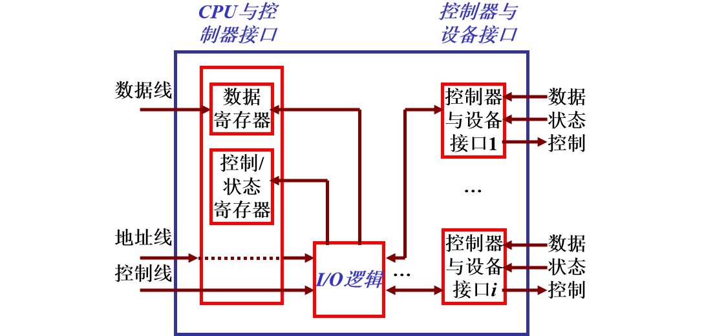

## I/O设备和设备控制器

### I/O设备分类

<table style="text-align: center">
    <tr>
        <td>分类标准</td>
        <td>设备类型</td>
        <td>特征</td>
        <td>典型设备</td>
    </tr>
    <tr>
        <td rowspan="4">设备的使用特性</td>
        <td>存储设备</td>
        <td>计算机系统用以存储信息的主要设备</td>
        <td></td>
    </tr>
    <tr>
        <td rowspan="3">输入/输出设备</td>
        <td>输入设备用来接收外部信息</td>
        <td>键盘、鼠标、扫描仪、视频摄像、各类传感器等</td>
    </tr>
    <tr>
        <td>输出设备是用于将计算机加工处理后的信息送向外部的设备</td>
        <td>打印机、绘图仪、显示器等</td>
    </tr>
    <tr>
        <td>交互式设备则是集成上述两类设备，用于同计算机交互</td>
        <td></td>
    </tr>
    <tr>
        <td rowspan="3">传输速率</td>
        <td>低速设备</td>
        <td>每秒钟几个字节至数百个字节</td>
        <td>键盘、鼠标、语音输入和输出设备等</td>
    </tr>
    <tr>
        <td>中速设备</td>
        <td>每秒钟数千个字节至数万个字节</td>
        <td>行式打印机、激光打印机等</td>
    </tr>
    <tr>
        <td>高速设备</td>
        <td>每秒钟数百千个字节至数十兆字节。</td>
        <td>磁带机、磁盘机、光盘机等</td>
    </tr>
    <tr>
        <td rowspan="2">信息交换的单位</td>
        <td>块设备</td>
        <td>以数据块为单位，传输速率较高，可寻址</td>
        <td>磁盘</td>
    </tr>
    <tr>
        <td>字符设备</td>
        <td>以字符为单位，传输速率较低，不可寻址</td>
        <td>如交互式终端、打印机等</td>
    </tr>
    <tr>
        <td rowspan="3">设备的共享属性</td>
        <td>独占设备</td>
        <td>一段时间内只允许一个用户（进程）访问的设备</td>
        <td></td>
    </tr>
    <tr>
        <td>共享设备</td>
        <td>一段时间内允许多个进程同时访问的设备，共享设备必须是可寻址的和可随机访问的设备</td>
        <td></td>
    </tr>
    <tr>
        <td>虚拟设备</td>
        <td>通过虚拟技术将一台独占设备变换为若干台逻辑设备，供若干个用户（进程）同时使用</td>
        <td></td>
    </tr>
</table>

### 设备控制器

设备控制器的主要功能：
- 接收和识别命令
- 数据交换
- 标识和报告设备状态
- 地址识别
- 数据缓冲
- 差错控制

设备控制器的组成：

（1）设备控制器与处理机的接口：该接口用于实现CPU与设备控制器之间的通信。共有三类信号线: 数据线、地址线和控制线。数据线通常与两类寄存器相连接：
- 数据寄存器，在控制器中可以有一个或多个数据寄存器，用于存放从设备送来的数据（输入）或从CPU送来的数据（输出）
- 控制/状态寄存器，在控制器中可以有一个或多个这类寄存器，用于存放从CPU送来的控制信息或设备的状态信息

（2）设备控制器与设备的接口

在一个设备控制器上，可以连接一个或多个设备。相应地，在控制器中便有一个或多个设备接口，一个接口连接一台设备。

在每个接口中都存在数据、控制和状态三种类型的信号。

（3）I/O逻辑

I/O逻辑用于实现对设备的控制，通过一组控制线与处理机交互，处理机利用该逻辑向控制器发送I/O命令；I/O逻辑对收到的命令进行译码。

## I/O控制方式

